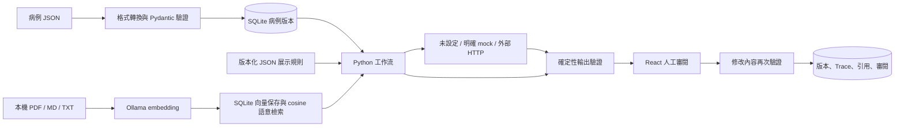

# 架構與工程決策

研究展示用／僅 synthetic 資料／非臨床使用。

## 模組與資料流

前端只顯示後端結果，不重做 AST 或臨床判斷。工作流以普通 Python 模組管理，節點包括病例完整性、AST、群體背景、快速鑑定、檢索、安全閘門、候選整理、人工審閱。節點不一定呼叫 LLM；人工審閱必須由使用者操作。

## 決策紀錄

1. 採 React + TypeScript + Vite、FastAPI + Pydantic，前後端分離。Linux 版本以 Node.js 24 與 Python 3.14 為目標環境；前端依賴使用明確版本並提交 lockfile，後端安裝後凍結相容依賴。
2. 採標準庫 sqlite3 與編號 SQL migration，未使用 ORM。原型以不可變 JSON 快照為主要資料；直接 SQL 能減少額外依賴，repository 邊界保留日後替換空間。
3. 文件索引為獨立 SQLite 檔，與病例 DB 置於同一 runtime 儲存範圍。正式備份需同時保存兩個 DB 與原始文件；跨 DB 不提供分散式交易。
4. 預設檢索使用 Ollama embedding 與 cosine similarity；文件向量保存於 SQLite，查詢時對符合政策的片段計算相似度，適用小型本機語料。模型或索引設定變更會使用獨立索引，舊文件不需重新上傳。FTS5／關鍵字只保留為明確選用的離線測試模式；embedding 失敗不會自動切換。PDF 解析不啟用臨床規則；OCR／複雜表格需另行處理。
5. 本機同步、有限 timeout 的執行 API；開始前保存 running，重啟恢復中斷狀態。不是大型背景任務平台，不依賴 Redis、Celery、Docker。
6. 外部模型只有使用者選擇 live 才呼叫。預設 unconfigured，mock 必須明確啟用；不自動 fallback。
7. 不實作正式登入、院端連線、醫囑、公開部署與臨床驗證。展示角色只是 UI 選項。

## 契約

`contracts/IMPLEMENTATION.md` 是模組邊界；`contracts/case.schema.json` 與 `contracts/openapi.json` 由後端產生。修改 Pydantic schema 後重新產生契約與前端型別，禁止前端另加醫療規則。

## 本次技術查核來源

- [Vite 執行環境需求](https://vite.dev/guide/)
- [FastAPI TestClient 測試](https://fastapi.tiangolo.com/tutorial/testing/)

以上只作工程參考，不是醫療證據。
